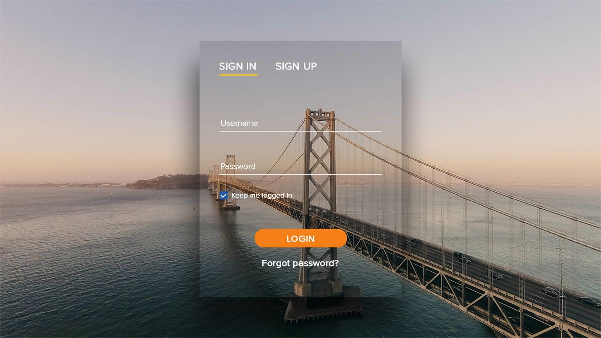

# LaundryPro

> Plataforma de punto de venta y operación para lavandería/planchado.
> POS + órdenes + caja + reportes + inventario, con enfoque real de producción.

[](https://www.python.org/)
[](https://www.djangoproject.com/)
[](https://www.django-rest-framework.org/)
[](https://www.postgresql.org/)
[](docs/production_runbook.md)
[](docs/production_runbook.md)

## Contenido

- [Estado del proyecto](#estado-del-proyecto)
- [Qué resuelve](#qué-resuelve)
- [Arquitectura técnica](#arquitectura-técnica)
- [Flujo de negocio validado (E2E)](#flujo-de-negocio-validado-e2e)
- [Vista rápida (UI)](#vista-rápida-ui)
- [Inicio rápido (desarrollo)](#inicio-rápido-desarrollo)
- [Variables de entorno clave](#variables-de-entorno-clave)
- [Seguridad implementada](#seguridad-implementada)
- [Auditoría crítica](#auditoría-crítica)
- [Backups y restauración](#backups-y-restauración)
- [Monitoreo y alertas](#monitoreo-y-alertas)
- [Pruebas recomendadas](#pruebas-recomendadas)
- [Despliegue productivo](#despliegue-productivo)
- [Comandos útiles](#comandos-útiles)
- [Estructura del repositorio](#estructura-del-repositorio)
- [Licencia](#licencia)

## Estado del proyecto

| Área | Estado |
| --- | --- |
| Backend Django/DRF | Listo |
| Seguridad de sesión/API | Implementado |
| Auditoría crítica | Implementada |
| Backups PostgreSQL | Implementados |
| Monitoreo y alertas | Implementado |
| Pruebas de regresión de negocio | Implementadas |
| Despliegue productivo (plantillas) | Listo |

## Qué resuelve

LaundryPro centraliza el flujo operativo de una lavandería:
- Recepción y gestión de órdenes.
- Registro de cobros y control de caja por turno.
- Seguimiento de pendientes y reportes operativos.
- Control de catálogo, clientes e inventario.

## Arquitectura técnica

- Framework: `Django 5` + `Django REST Framework`
- Base de datos: `PostgreSQL` (dev opcional con SQLite)
- App server: `Gunicorn`
- Reverse proxy: `Nginx`
- TLS: `Let's Encrypt`
- Estáticos: `WhiteNoise`

Módulos principales:
- `apps/accounts`: autenticación, roles, autorización.
- `apps/orders`: órdenes, items, flujo de entrega.
- `apps/payments`: caja, cobros, cierre diario.
- `apps/catalog`: servicios y precios.
- `apps/inventory`: inventario y egresos.
- `apps/reports`: reportes operativos y ejecutivos.
- `apps/common`: seguridad transversal, auditoría, alertas.

## Flujo de negocio validado (E2E)

Flujo automatizado por prueba:
`abrir caja -> crear orden -> cobrar -> entregar -> cerrar caja -> corte diario`

Archivo de prueba:
- `apps/payments/tests/test_business_regression_flow.py`

## Vista rápida (UI)

Pantallas incluidas en el proyecto:

### Login



### Dashboard / Operación


### Referencia visual


## Inicio rápido (desarrollo)

```bash
python -m venv .venv
source .venv/bin/activate
pip install -r requirements/dev.txt
cp .env.example .env
python manage.py bootstrap_pos
python manage.py runserver
```

## Variables de entorno clave

Definir en `.env`:

| Variable | Propósito |
| --- | --- |
| `DJANGO_ENV` | `dev` o `prod` |
| `DJANGO_SECRET_KEY` | Clave secreta fuerte |
| `DJANGO_DEBUG` | `0` en producción |
| `DATABASE_URL` | Conexión PostgreSQL |
| `DJANGO_ALLOWED_HOSTS` | Hosts permitidos |
| `CSRF_TRUSTED_ORIGINS` | Orígenes confiables |
| `SESSION_INACTIVITY_TIMEOUT_SECONDS` | Logout por inactividad |
| `PASSWORD_MAX_AGE_DAYS` | Rotación de credenciales |
| `API_THROTTLE_*` | Límite de peticiones API |
| `CASH_DIFF_ALERT_THRESHOLD` | Umbral alerta diferencia de caja |

## Seguridad implementada

- Contraseñas fuertes (longitud y complejidad).
- Expiración por inactividad de sesión.
- Rotación de credenciales por edad máxima.
- Rate limit de login anti fuerza bruta.
- Throttling API por usuario/IP.
- Permisos por objeto en caja/cobros.
- Log de accesos denegados (`401/403/429`).
- Política de llaves SSH (`SSH key only`) para repositorio/servidor.

Referencias:
- `apps/common/security_middleware.py`
- `apps/common/validators.py`
- `apps/common/throttling.py`
- `apps/common/api_exception_handler.py`
- `deploy/ssh/sshd_hardening.conf`

## Auditoría crítica

Eventos auditados automáticamente en `apps_common_auditlog`:
- `service.price_changed`
- `order.cancelled`
- `payment.created`
- `payment.edited`
- `payment.voided`
- `cash_session.closed`

Referencias:
- `apps/common/models.py`
- `apps/common/signals.py`
- `apps/common/audit.py`

## Backups y restauración

Scripts listos:
- Backup diario: `ops/backups/pg_backup.sh`
- Prueba de restauración: `ops/backups/pg_restore_smoke_test.sh`
- Variables: `ops/backups/backup.env.example`

## Monitoreo y alertas

Alertas operativas (`apps_common_operationalalert`):
- `database.unavailable`
- `http.server_error`
- `cash_session.high_difference`

Herramientas:
- Comando: `python manage.py check_operational_alerts --minutes 60`
- Unit/timer: `deploy/systemd/laundrypro-alert-check.service`, `deploy/systemd/laundrypro-alert-check.timer`

## Mejoras de producto vendible (fase actual)

- Dashboard ejecutivo con semáforos de caja, pendientes, atraso y salud técnica:
  - `templates/accounts/manager_dashboard.html`
  - `apps/accounts/web_views.py`
- Formato uniforme de moneda/fecha en dashboards:
  - `apps/common/templatetags/formatters.py`
- Catálogo premium:
  - historial de precios por servicio (`ServicePriceHistory`)
  - promociones temporales (`ServicePromotion`)
  - endpoints API: `/api/catalog/price-history/`, `/api/catalog/promotions/`
- Manual operativo formal imprimible:
  - `templates/accounts/operations_manual_print.html`
  - ruta: `/manual/print/`

## Pruebas recomendadas

Suite completa de seguridad, auditoría, monitoreo y regresión:

```bash
python manage.py test \
  apps.accounts.tests.test_security \
  apps.accounts.tests.test_authorization \
  apps.accounts.tests.test_permissions_matrix \
  apps.accounts.tests.test_session_and_api_hardening \
  apps.common.tests.test_audit \
  apps.common.tests.test_monitoring_alerts \
  apps.payments.tests.test_business_regression_flow -v 2
```

Chequeo de producción:

```bash
DJANGO_SETTINGS_MODULE=config.settings.prod python manage.py check --deploy
```

## Despliegue productivo

Plantillas incluidas:
- `deploy/systemd/laundrypro.service`
- `deploy/nginx/laundrypro.conf`
- `deploy/systemd/laundrypro-backup.service`
- `deploy/systemd/laundrypro-backup.timer`

Guía paso a paso:
- `docs/production_runbook.md`

## Comandos útiles

```bash
python manage.py seed_roles
python manage.py seed_employees
python manage.py seed_catalog
python manage.py migrate
python manage.py collectstatic --noinput
```

## Estructura del repositorio

```text
apps/
config/
deploy/
docs/
ops/
requirements/
static/
templates/
```

## Licencia

Licencia propietaria (`All Rights Reserved`).

Uso, copia, modificación o distribución solo con autorización escrita del titular.
Consulta el archivo `LICENSE`.
